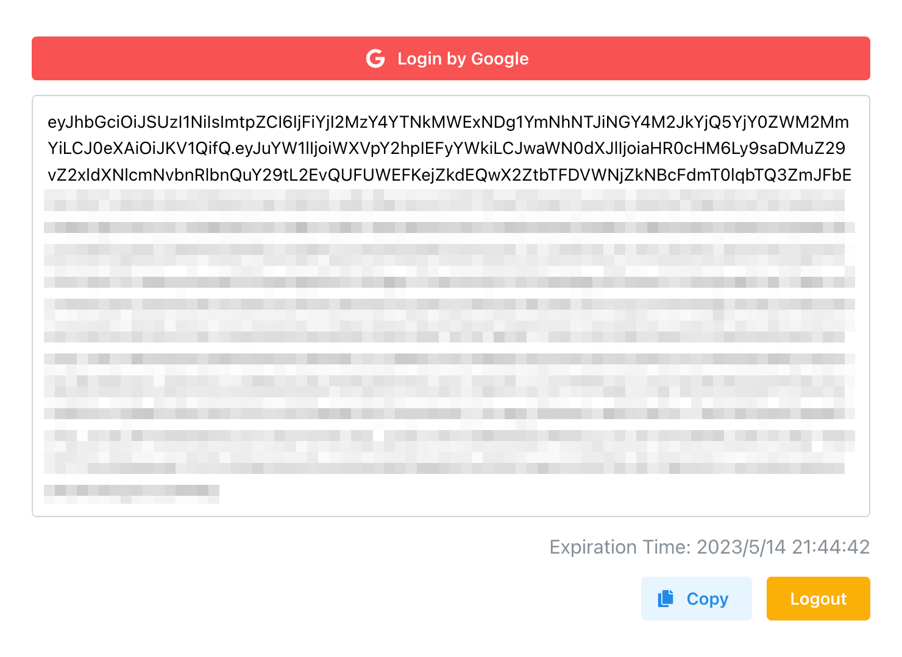

# Firebase Authentication ID Token Copying Web Application

## Overview
This application is designed to help you quickly and easily copy Firebase Authentication ID Tokens. It's a convenient tool for developers working with Firebase, allowing them to test or debug user-related functionality in their Firebase applications.



## Installation
First, clone the repository:

```bash
git clone https://github.com/u1aryz/firebase-auth-token-copy-ui.git
cd firebase-auth-token-copy-ui
```

Next, install the necessary dependencies:

```bash
pnpm install
```

## Configuration
Before starting the application, you need to set up your Firebase project and get your configuration details.

```bash
cp .env.example .env
```

Enter your Firebase configuration.

## Usage
To start the application, run:

```bash
pnpm run dev
```

You can then access the web application at http://localhost:5173.

To copy a Firebase Authentication ID Token, follow these steps:

1. Click `Login by Google`
2. Click `Copy`

Please note: This application is intended for testing and debugging purposes. It should not be used in production environments.

## License
```
Copyright 2023 Yuichi Arai (@u1aryz)

Permission is hereby granted, free of charge, to any person obtaining a copy of this software and associated documentation files (the "Software"), to deal in the Software without restriction, including without limitation the rights to use, copy, modify, merge, publish, distribute, sublicense, and/or sell copies of the Software, and to permit persons to whom the Software is furnished to do so, subject to the following conditions:

The above copyright notice and this permission notice shall be included in all copies or substantial portions of the Software.

THE SOFTWARE IS PROVIDED "AS IS", WITHOUT WARRANTY OF ANY KIND, EXPRESS OR IMPLIED, INCLUDING BUT NOT LIMITED TO THE WARRANTIES OF MERCHANTABILITY, FITNESS FOR A PARTICULAR PURPOSE AND NONINFRINGEMENT. IN NO EVENT SHALL THE AUTHORS OR COPYRIGHT HOLDERS BE LIABLE FOR ANY CLAIM, DAMAGES OR OTHER LIABILITY, WHETHER IN AN ACTION OF CONTRACT, TORT OR OTHERWISE, ARISING FROM, OUT OF OR IN CONNECTION WITH THE SOFTWARE OR THE USE OR OTHER DEALINGS IN THE SOFTWARE.
```
