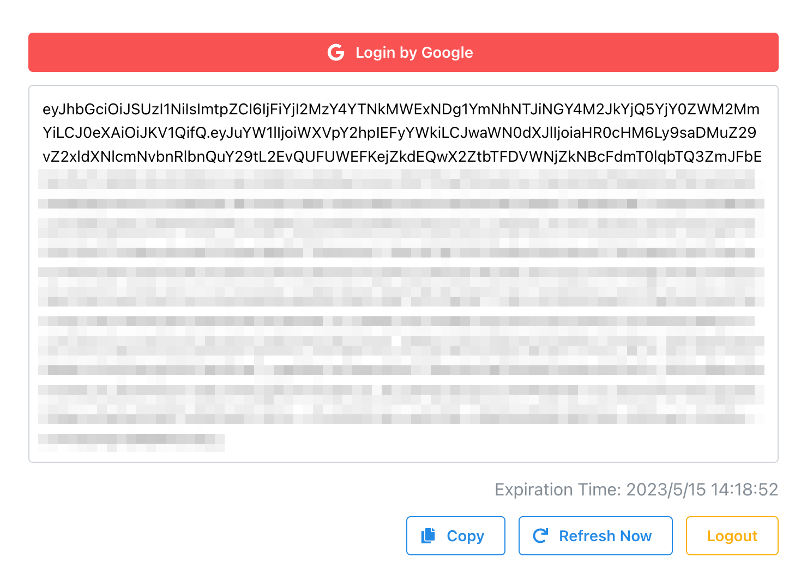

# Firebase Authentication ID Token Copying Web Application

## Overview
This application is designed to help you quickly and easily copy Firebase Authentication ID Tokens. It's a convenient tool for developers working with Firebase, allowing them to test or debug user-related functionality in their Firebase applications.



## Installation
First, clone the repository:

```bash
git clone https://github.com/u1aryz/firebase-auth-token-copy-ui.git
cd firebase-auth-token-copy-ui
```

Next, install the necessary dependencies:

```bash
pnpm install
```

## Configuration
Before starting the application, you need to set up your Firebase project and get your configuration details.

```bash
cp .env.example .env
```

Enter your Firebase configuration.

## Usage
To start the application, run:

```bash
pnpm run dev
```

You can then access the web application at http://localhost:5173 by default.

To copy a Firebase Authentication ID Token, follow these steps:

1. Click `Login by Google`
2. Click `Copy`

Please note: This application is intended for testing and debugging purposes. It should not be used in production environments.

## License

[MIT](LICENSE) &copy; [u1aryz](https://u1aryz.com)
